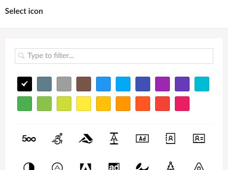
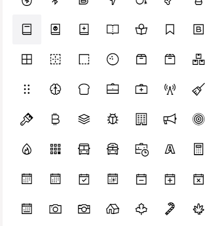

# Line Awesome Icon Pack for Umbraco
Umbraco package setup to incorporate Line Awesome collection of icons for document and media types

## Installation
This package can be installed by downloading the [Line Awesome Icon Pack package archive](https://our.umbraco.com/packages/backoffice-extensions/line-awesome-icon-pack/) from Packages section from Our Umbraco and installing it from the Backoffice.

## Using Icons from the Line Awesome Icon Pack
While working with the definitions of document or media types in the Backoffice > Settings, click on the icon for the type you are working with to the pull up the 'Select icon' side bar.  The Line Awesome icons will be presented with the original Umbraco installed icons.

If you would like to view only Line Awesome icons, type 'la-' in the 'Type to filter...' textbox. 

## Credits
Line Awesome is an alternative to Font Awesome and its made freely available by Icons8.  To learn more or even include Line Awesome in another project, please visit [https://icons8.com/line-awesome](https://icons8.com/line-awesome).